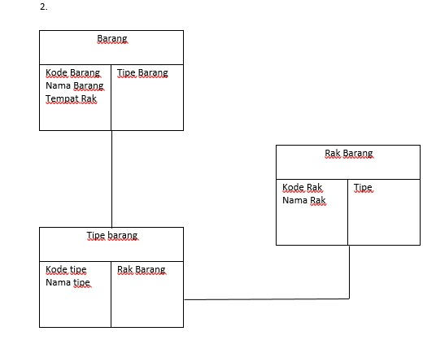

# LATIHAN 1

## بِسْمِ اللَّهِ الرَّحْمَنِ الرَّحِيم  

## CRC CARD

### SEKILAS TENTANG CRC CARD

_CRC_ merupakan suatu class yang digunakan untuk mendefinisikan apa saja yang bisa dilakukan oleh suatu objek

Didalam _CRC_ objek didefinisikan dengan kemampuan tertentu dan dapat membutuhkan objek lain yang digunakan untuk menyelesaikan kemampuan dari objek tersebut

sebagai contoh saya ambil dari _CRC_ yang telah kalian [buka](http://agilemodeling.com/artifacts/crcModel.htm)

Seorang objek `mahasiswa` dapat mempunyai nama, alamat, nomor telepon, dll, serta dapat mendaftar ke seminar atau menghapus seminar

dalam hal ini, nama, alamat, nomor telepon merupakan responsibilies,atau kemampuan yang dimiliki mahasiswa

sedangkan mendaftar dan menghapus seminar, juga merupakan responsibilities, tetapi membutuhkan objek baru yang bernama `seminar`

---

## LATIHAN

Untuk latihan, kita akan membuat CRC tentang sesuatu yang mudah dan sering diimplementasian di kehidupan
Pilihan CRC Card

1. CRC Gaji Karyawan
2. CRC Manajemen Barang
3. Dll

---

## CRC GAJI KARYAWAN

Tentukan dulu apa saja yang biasa ada di pembelian

- Department
- Karyawan
- Absen

### DEPARTMENT

```txt
-------------------------------------
| DEPARTMENT                        |
-------------------------------------
| Kode Department  |   Karyawan     |
| Nama Department  |                |
| Gaji Per jam     |                |
| Tambah Karyawan  |                |
| Hapus Karyawan   |                |
-------------------------------------
```

## KARYAWAN

```txt
-------------------------------------
| KARYAWAN                          |
-------------------------------------
| Kode Karyawan   |  Absen          |
| Nama Karyawan   |                 |
| Daftar Hadir    |                 |
-------------------------------------
```

### ABSEN

```txt
-------------------------------------
| ABSEN                             |
-------------------------------------
| Kode Karyawan  |                  |
| Jam Masuk      |                  |
| Jam Keluar     |                  |
-------------------------------------
```

### FULL IMAGE KARYAWAN


---

## CRC MANAJEMEN BARANG

Tentukan dulu apa saja yang biasa ada di pembelian

- Tipe Barang
- Rak Barang
- Barang

### TIPE BARANG

```txt
-------------------------------------
| TIPE BARANG                       |
-------------------------------------
| Kode Tipe   |   Rak               |
| Nama Tipe   |                     |
-------------------------------------
```

## RAK BARANG

```txt
-------------------------------------
| RAK BARANG                        |
-------------------------------------
| Kode Rak   |  Tipe                |
| Nama Rak   |                      |
-------------------------------------
```

### BARANG

```txt
-------------------------------------
| BARANG                            |
-------------------------------------
| Kode Barang   |   Rak             |
| Nama Barang   |                   |
| Tempat Rak    |                   |
-------------------------------------
```

### FULL IMAGE MANAJEMEN BARANG


