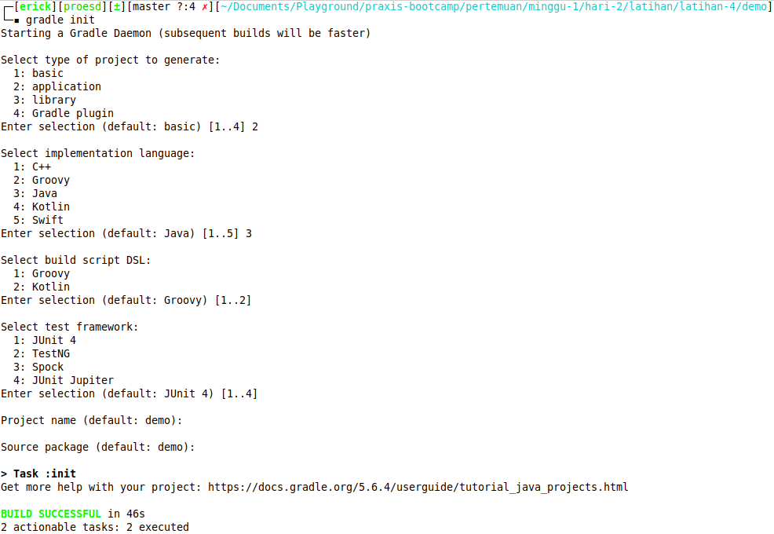
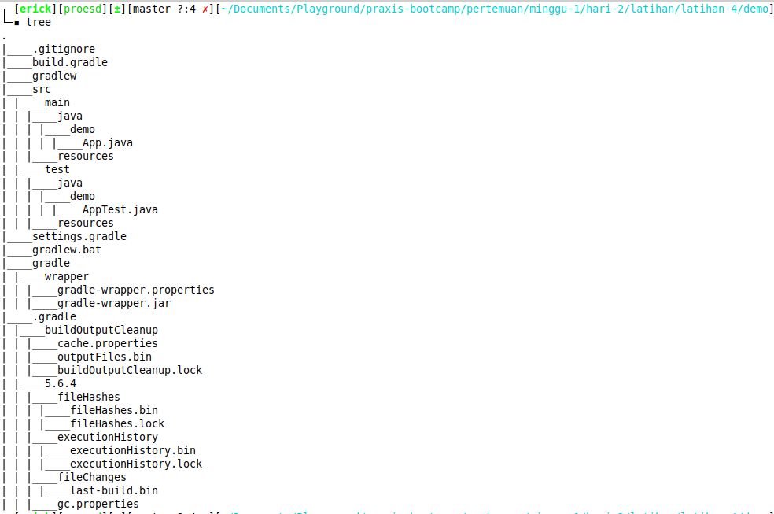
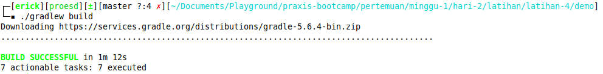
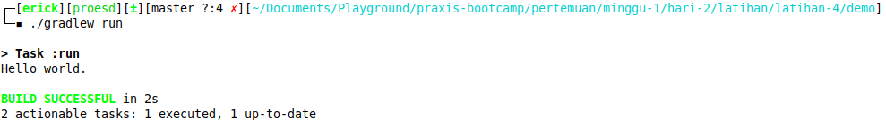

# GRADLE

## بِسْمِ اللَّهِ الرَّحْمَنِ الرَّحِيم  

Sesuai dengan tutorial yang diberikan

Langkah - langkahnya :

1. Buat folder demo `mkdir demo`
2. pindah ke folder demo `cd demo`
3. Init gradle di dalam folder demo `gradle init`
4. Pilih sesuai tutorial yang diberikan
    - Selection `6`
    - Build Script DSL langsung enter
    - Test framework langsung enter
    - Project name langsung enter
    - Source package langsung enter

    
    **note** : ternyata tutorialnya berbeda dengan yang asli, tidak masalah
5. Struktur foldernya
    
6. Didalam `settings.gradle` terdapat nama project kita
7. Didalam `build.gradle` terdapat kumpulan library yang bisa kita gunakan maupun dapat kita tambahkan, selain itu disini juga ada `main.ClassName` yang akan dieksekusi pertama saat program dijalankan, file tersebut terdapat di `src/main/java/demo/App.java`, terdapat juga `test class`, file tersebut ada di `src/test/java/demo/AppTest.java` yang berguna untuk menjalankan unit testing di aplikasi kita
8. Eksekusi dengan `./gradlew build`, harus mempunyai internet aktif saat pertama kali instalasi, digunakan untuk download library yang digunakan di aplikasi kita, setelahnya library akan disimpan di `cache` sehingga pada saat eksekusi program lain yang berikutnya tidak perlu download lagi karena akan menggunakan library yang ada di `cache`, kecuali ada library baru yang ditambahkan
    
9. hasil `unit testing` berada di file `build/reports/tests/test/index.html` silahkan dibuka lewat browser
10. Sebelum menjalankan aplikasi, kita perlu command `./gradlew tasks` untuk mengetahui opsi apa saja yang bisa digunakan.
11. Setelah kita tahu opsinya, jalankan dengan `./gradlew run` untuk menjalankan aplikasi kita
    
12. **SELESAI**
