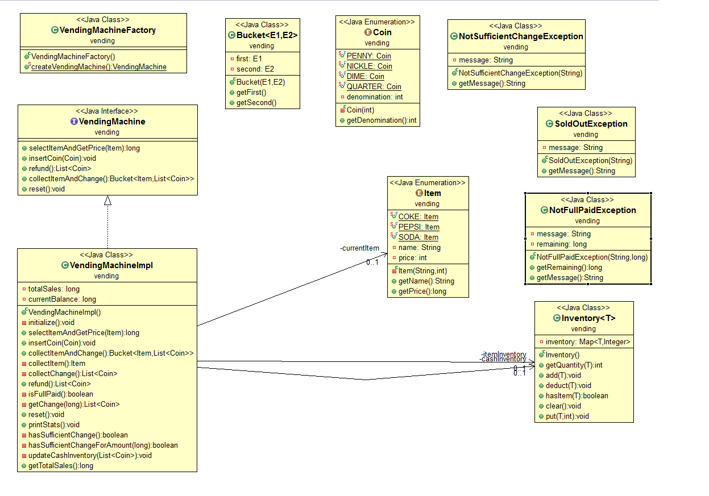

# Vending Machine

## بِسْمِ اللَّهِ الرَّحْمَنِ الرَّحِيم  

Didalam Folder `kasus-1` terdapat `gradle` project

Langkah nya adalah

1. `gradle init` pada file tersebut, nanti akan ada pilihan, untuk pilihan pertama kita akan buat `applications` untuk yang selanjutnya sesuaikan dengan `default` settingsnya, ketika sampai di nama project kita tentukan `vending` untuk nama projectnya
2. Setelah itu silahkan tulis kode dari website yang telah diberikan pada panduannya.
3. Jika sudah semua, langkah selanjutnya yaitu merubah `App.java` dengan mengimplementasikan `VendingMachineFactory` atau mengimplemtasikan `VendingMachine`, seperti yang terlihat pada akhir tutorial, lihat gambar UML nya 
4. Setelahnya silahkan tulis sesuka kalian, mau kalian apakan `VendingMachine` nya

Terima Kasih